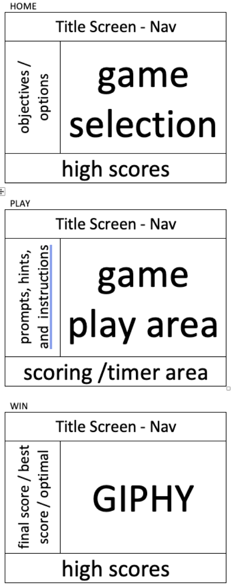

# Tower of Hanoi 2.0 Overview

A refactoring of Tower of Hanoi project

## Project Description

This project will be a refactoring of my Tower of Hanoi game done completely in JS. Intent is to reflect a real world situation of refactoring "old" code into react/react-router and begin exploring use of react-hooks. Additionally, this will allow me to make improvements upon the original game.

## Project Links
- [github repo](https://github.com/elkins2k/project-2/)
- [deployment](https://elkins2k.github.io/TowerOfHanoi2/)

## Wireframes
<details><summary>wireframes</summary>

</details>
<details><summary>react architecture </summary>
 	<ul>
		<li> Header nav
 		<li> Information sidebar
		<ul>
	 		<li> Home
			<li> Play
			<li> Win </ul>
 		<li> Main screen area
	 	<ul>
		 	<li> Home
			<li> Play
			<li> Win </ul>
		<li> Scoring footer
		<ul>
			<li> High scores
			<li> Current game scoring</ul>
</details>

### MVP/PostMVP
#### MVP
> ##### home
>> allow user to select "size of game" to play
>
>> provide instructions how to play and the objectives of the game
>
>> list all high scores and best times at bottom of screen

> ##### play
>> user choses a source stack to move top disk from, then selects the target stack to move to
>
>> allow move if disk being moved is smaller than top disk on the target stack
>
>> game ends when all disks are stacked on the far-right stack

> ##### win
>> count number of moves and time taken to win
>
>> compare count to optimal solution (2^# - 1)
>
>> if player does not match optimal, suggest player "try again" or allow them to try a different number of disks.
>
>> track player "best score/time".
>
>> if player matches optimal, congratulate them and suggest they try a harder level or improve thier time.

#### PostMVP
> refactor again using react hooks

## Components

| Component | Description | 
| :---: | :---: |  
| App | This will make the initial data pull and include React Router| 
| Header | This will render the header include the nav | 
| HomeSidebar | This will render the sidebar with game objectives |
| HomeMain | This will render the main game area with level/disk selection |
| HighScoreFooter | This will render the footer with high score information |
| PlaySidebar | This will render the sidebar with in-game prompts, hints, etc. |
| PlayMain | This will contain the stacks |
| Stacks | This will render the stacks |
| ScoringFooter | The will render the current game statistics with moves, time, etc. |
| WinSidebar | The will render post-game prompts |
| WinMain | This will render the win graphic |

## Time Frames
| Component | Priority | Estimated Time | Actual Time |
| --- | :---: |  :---: | :---: |
| react refactoring | H | 3 days| TBD |
| hooks refactoring | M | 2 days| TBD |
| Total | H | 5 days| TBD |

## Additional Libraries
> Axios - to call the GIPHY API
>
> API Endpoint: https://api.giphy.com/v1/gifs/search&tag=&rating=G&q=win
>

## Code Snippet
```javascript
function reverse(string) {
	// Use this section to include a brief code snippet of functionality that you are proud of an a brief description.  Code snippet should not be greater than 10 lines of code. 
}
```

## Issues and Resolutions
 Use this section to list of all major issues encountered and their resolution.

#### SAMPLE.....
**ERROR**: app.js:34 Uncaught SyntaxError: Unexpected identifier                                
**RESOLUTION**: Missing comma after first object in sources {} object