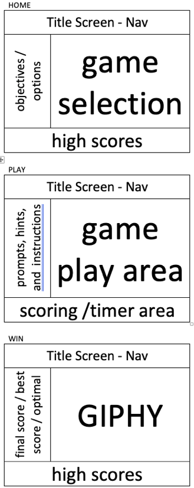

# Tower of Hanoi 2.0 Overview

A refactoring of Tower of Hanoi project

## Project Description

This project will be a refactoring of my Tower of Hanoi game done completely in JS. Intent is to reflect a real world situation of refactoring "old" code into react/react-router and begin exploring use of react-hooks. Additionally, this will allow me to make improvements upon the original game.

## Project Links
- [github repo](https://github.com/elkins2k/project-2/)
- [deployment](https://elkins2k.github.io/TowerOfHanoi2/)

## Wireframes

wireframes

react architecture 

 	<ul>
		<li> Header nav
 		<li> Information sidebar
		<ul>
	 		<li> Home
			<li> Play
			<li> Win </ul>
 		<li> Main screen area
	 	<ul>
		 	<li> Home
			<li> Play
			<li> Win </ul>
		<li> Scoring footer
		<ul>
			<li> High scores
			<li> Current game scoring</ul>

### MVP/PostMVP
#### MVP
> ##### home
>> allow user to select "size of game" to play
>
>> provide instructions how to play and the objectives of the game
>
>> list all high scores and best times at bottom of screen

> ##### play
>> user choses a source stack to move top disk from, then selects the target stack to move to
>
>> allow move if disk being moved is smaller than top disk on the target stack
>
>> game ends when all disks are stacked on the far-right stack

> ##### win
>> count number of moves and time taken to win
>
>> compare count to optimal solution (2^# - 1)
>
>> if player does not match optimal, suggest player "try again" or allow them to try a different number of disks.
>
>> track player "best score/time".
>
>> if player matches optimal, congratulate them and suggest they try a harder level or improve thier time.

#### PostMVP
> refactor again using react hooks

## Components

| Component | Description | 
| :---: | :---: |  
| App | This will make the initial data pull and include React Router| 
| Header | This will render the header include the nav | 
| HomeSidebar | This will render the sidebar with game objectives |
| HomeMain | This will render the main game area with level/disk selection |
| HighScoreFooter | This will render the footer with high score information |
| PlaySidebar | This will render the sidebar with in-game prompts, hints, etc. |
| PlayMain | This will contain the stacks |
| Stacks | This will render the stacks |
| ScoringFooter | The will render the current game statistics with moves, time, etc. |
| WinSidebar | The will render post-game prompts |
| WinMain | This will render the win graphic |

## Time Frames
| Component | Priority | Estimated Time | Actual Time |
| --- | :---: |  :---: | :---: |
| react refactoring | H | 3 days| 6 days |
| hooks refactoring | M | 2 days| NA |
| Total | H | 5 days| 6 days |

## Additional Libraries
> Axios - to call the GIPHY API
>
> API Endpoint: https://api.giphy.com/v1/gifs/search
>

## Outstanding Issues
**ISSUE**: State is not getting set before components are called relying on props in several situations.
**RESOLUTION**: Not resolved. This is leading to High Scores not getting updated or even being displayed during play. This has also lead to several statments being commented out so as not to display erroneous information.

## Final Thoughts
Overall, the "final" product is not completely taking correct advantage of React rendering by forcing rendering "unnaturally" in some cases. As I struggled early on in the framing and design concept, I was forced to make trade-offs to meet time constraints in order to produce a functioning product. If I had to do it over, I would have taken a different approach to my components, which I believe would alleviate a lot of the functionality flaws currently in the solution. However, my disappointment in the product I'm submitting aside, I have learned a lot about design and function of React, which I believe is the overarching intent of these projects.